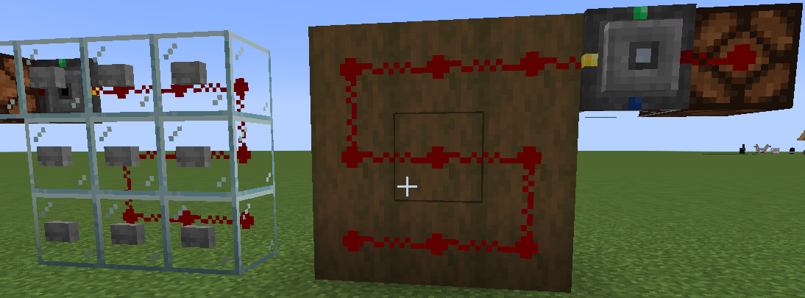
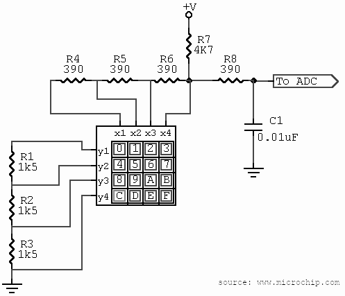

### RCA Example: Using Analog Input for 3x3 Button Keypad

This example originates in the door lock control setup by `McnzStone`,
and uses one input (here `Y`ellow) to latch a 3x3 button code sequence.

#### Setup



#### RLC program

```
# Input latching 1..9
I = IF(Y.RE, Y-6, I)

# Combination 0..999
C = IF(Y.FE, (C*10+I) % 1000, C)

# Timeout 10s * 20tick/s, first
# input starts the timer.
T = TP1(Y.RE, 20*10)

# Hold C as long TP1 active
C = IF(T, C, 0)

# Output if combination ok
R = (C == 159)
```

#### How it works

  1. If a button is pressed, the input `Y` changes from 0 to a value
     between 7 and 15, depending on which button was pressed. That
     means we also get a *rising edge* on `Y` in this tick. The input
     storage variable `I` is only changed then, otherwise kept at its
     own (last) value. By subtracting `6`, we get values from 1 to 9.

  2. When the button is released, the signal changes again to 0, and
     so we get a *falling edge* on `Y`. Our `I` value was already
     updated correctly, so we can feed it now into the combination
     storage variable `C` by "shifting" one digit up (`C*10`), and add
     the last input (`+I`). As we use a 3 digit code, every higher
     digit is cut off (`% 1000`). `C` is simply kept at its last value
     if we don't have a falling edge. (at least in this code line).

  3. To reset combination after a while, we use a pulse timer `TP1`.
     It starts at the first button click, and remains active for 10s
     (200t).

  4. As long as the timer is pulse it active, the combination `C` is
     kept as evaluated above. After the 10s have expired, the timer
     resets, and `C` is forced to 0 again (aka. combination reset).

  5. The output port `R` is `ON` (`15`) as long as `C` holds the correct
     combination, here `159`.

To quickly trace this:

  - We press the bottom-left button (right side wood panel in the
    image) -> `I=1` and TP1 starts the 10s -> `C=0*10+1 = 001` ->
    `R=0` (`001 != 159`).

  - We press the center button -> `I=5` -> `C=1*10+5 = 015` -> `R=0`
    (`015 != 159`).

  - We press the top-right button -> `I=9` -> `C=15*10+9 = 159` ->
    `R=15` (`159 == 159`).

  - After 10s -> `C=0`. `R=0` (`000 != 159`).

---

#### Annotations

This technique is also used in real world micro controllers when there
are too few input pins. A keypad matrix is connected to a resistor network
in a way that the ADC value for each key is well enough distinguishable
from other keys. This solution comes with a "price" though: You cannot
safely detect multiple keys pressed at the same time, and connection
problems (impedance changes etc) are hard to detect.




(Circuit source: [microchip.com](https://www.microchip.com/forums/download.axd?file=0;694632&where=&f=1pin%20keymatrix.gif))
