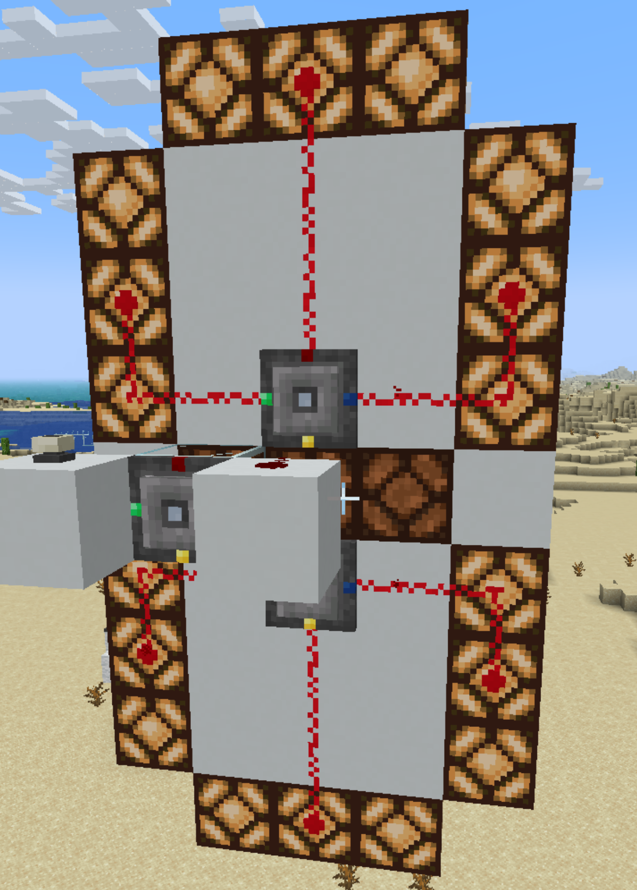

### RLC Example: Redstone Lamp 7-Segment Display.

This example shows a 9x5 block wide seven-segment display
*(contraption and code by Aerotactics)*.

The redstone signals incoming at the back side of the RLCs (`U` port)
are encoded into the segments at the sides of the controllers (`R`,`G`,`Y`,`B`).

```
# Top RLC
G = U == 0 | U == 1 | U == 2 | U == 3 | U == 4 | U == 7 | U == 8 | U == 9
R = U == 0 | U == 2 | U == 3 | U == 5 | U == 6 | U == 7 | U == 8 | U == 9
B = U == 0 | U == 4 | U == 5 | U == 6 | U == 8 | U == 9
```

```
# Bottom RLC
R = U == 2 | U == 3 | U == 4 | U == 5 | U == 6 | U == 8 | U == 9
G = U == 0 | U == 1 | U == 3 | U == 4 | U == 5 | U == 6 | U == 7 | U == 8 | U == 9
Y = U == 0 | U == 2 | U == 3 | U == 5 | U == 6 | U == 8
B = U == 0 | U == 2 | U == 6 | U == 8
```


