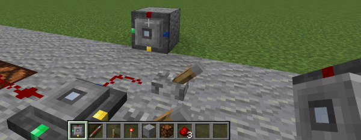
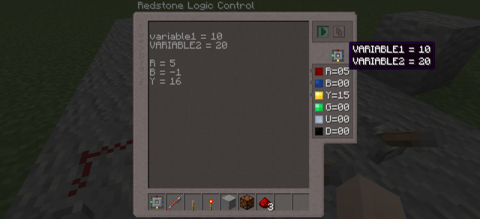

# Redstone Logic Control Introduction and Examples

Okay ladies and guys, here's a bit of function principle, some examples
and debugging tricks for the RLC.

### Placement and User Interface

Let's start with the block and GUI, and how we can get signals in and out
of it. First, when placing the block, you can chose direction and face,
which can also be on walls or on the ceiling. The block will be directed
depending on how you move the crosshair away from the centre of the
placement location (the red I/O port technically the "front"). So in case
you relocate your setup, you don't need to rewrite the controller program,
but simply place it in the way it was correct before.



Taking a first glance at the GUI, you see mostly a big editor area where
you can type your code. Faint outlined at the left are "quick reference"
symbols. Hovering these shows brief help tooltips[°](#manual). Top-right is the
*Run/Stop* button, and a quick-copy-paste button. The latter copies code into
your clipboard if there is something written there, and pastes from your
clipboard if the code area is empty. Pressing the *Run* button will lock the
editor, the controller reads your code into a fast machine format, and
executes the program. While the program is running, the Redstone I/O values
at the right are frequently updated. This is also done for internal variables
which, are not in the port list. You can inspect these variables by hovering
the *Ports* symbol (looks like the block; also shows where the port colors
are located on the outside). Press the *Run/Stop* button again to halt the
controller for editing or reset.



And that's the GUI. The rest is about what we type into the code area.

### Ports and Signal Basics

Before we dig into the matter, let's quickly discuss how the controller
sees and interacts with the Redstone world outside (it may likely boil
down to "pretty much as already expected", but naming and refining the
aspects can help troubleshooting later on).

According to *Ports*, each side of the block can be used. The port naming
by color (first letter `R`,`B`,`Y`,`G`) for the lateral directions, `U`
for up and `D` for down. Each of them can be used as:

  - ***Output***: A signal is emitted/sent there, but the port is not
    read, so changes outside are ignored by the controller. You don't
    need to configure the output direction, it is automatically set if
    you *assign* the port variable, e.g. `R = 5` sets port red to output.

  - ***Input***: A signal is read there, and the controller reacts to
    external changes. Inputs are automatically configured when you *use*
    a port variable (and if it is not already an output of corse). So
    `myvariable = Y + B` implicitly sets yellow and blue to input.

  - ***Comparator Signal Input***: Very similar to a "normal" Redstone
    input, except that the value, which a vanilla Redstone Comparator
    would detect, is read. You use these with the `.CO` (*"Comparator
    Output"*) suffix of a port, e.g. `myvar = Y.CO`. The data processing
    is exactly the same as for Redstone signal inputs. Note that the RLC
    cannot output such comparator signals.

  - ***Unused***: If you don't use a port, it is implicitly disabled
    and ignored.

According to the *signal processing*, we have to differ between two (well
known) "types" of data, and how the RLC sees them. To quickly recap, the
RLC is about processing vanilla Redstone signals, which have a value range
between `0` and `15`. When a lever or button is `OFF`, the output is `0`,
if it is `ON`, the output is `15`. Now we take a look how Redstone Lamps
work. They are `OFF` if the input power is `0`, and lit `ON` if the power
is `>0`. At the time of writing this, all vanilla Minecraft blocks with
Redstone inputs (except the Comparator) follow this "powered-or-not" logic
pattern (Piston, doors, Hopper, Dispenser, etc) - so should the RLC then:

  - ***Logic Levels***: The RLC sees ***inputs*** for logical operations
    like the vanilla elements described above: `0` means `OFF` or `FALSE`,
    and everything `>0` is seen as `ON`/`TRUE` (alas, `-2` is also `OFF`,
    and `10000` is also `ON`, this may come in handy later when doing some
    calculations).

    In a similar way, the ***outputs*** of logical functions and operators
    in the RLC are `0` if the logic result is `FALSE`, and `15` if the logic
    result is `TRUE` (`X AND Y` is never 1 or 8, but always `0` or `15`).

  - ***Arithmetics***: Simple Integer arithmetic (with a 32bit value range,
    about +-2.1 billion). You can add, subtract, multiply, divide, modulo,
    etc, store the results in variables, and assign them to ports. If you
    divide, the fraction/decimals will be cut off (`3/2` is `1`, not `1.5`).
    There is no limiting from 0 to 15 for arithmetic operations or internal
    variables - however, if you assign to one of the output ports, then the
    port value is trimmed to the known Redstone signal range `0` to `15`.

### Program Flow and Syntax

Right, now we know how signals and values are transferred and seen by the
controller. Missing is what to actually type to make it do anything.

You program the RLC using simple assignment expressions similar to math
equations. These lines are calculated top-down in one go, and the result
value of each line is transferred to memory (means you can also overwrite
values in lines below). The final results are relevant for the output ports,
and these are also the values you see in the variable inspection lists.
Before calculating, the controller reads all used inputs, and after finishing calculations it writes the outputs (you don't have to worry that inputs
may change between the lines). So, each *execution* tick has the following
program flow:

  1. Read all input ports to memory, overwrite old input variable values.
     All other variables in memory remain unchanged.

  2. Calculate all lines of the program. Variables and port values that
     you assign are changed for calculation lines below, but the changes
     are not directly active at the block outputs.

  3. Write the final output results to their ports.

The syntax of each line follows the pattern `Variable = Expression`.
The hash `#` allows to comment your code:

```
# 1. Inputs are read, here Y,G, and B.

# 2. Calculate all lines:

  # Assign red to yellow + green. R is now output, and
  # yellow/green are implicitly read as inputs. Because
  # R is a port, its value is clamped to 0..15.
  R = Y + G

  # We use the output value of R directly for a logical
  # operation, so the "down" port is 15 if R and the blue
  # input are both ON (aka >0), otherwise D will be 0.
  # R or B do not get changed in this line.
  D = R AND B

  # Z is not a port, but a variable name we picked. Therefore
  # its value is not limited and can be as high as Y+G can get,
  # aka 0..30.
  Z = Y + G

# 3. Program finished, now the ports R and D are changed to
# their new calculation results. The variable Z is unused,
# but it is calculated, and you can see its value.
```

### Arithmetic Operations

Arithmetic stuff is nothing fancy. For the "offline example" we
simulate inputs by assigning the ports before:

```
# (U and D used as outputs)
# Simulated input signals:
  R = 15
  B = 11
  Y = 5
  G = 0

# Program

X1 =  R + B     # ->  26 |
X2 =  R - B     # ->   4 |
X3 =  R * B     # -> 165 |
X4 =  R / B     # ->   1 | trimmed towards 0
X5 = -R / B     # ->  -1 |
X6 =  R % B     # ->   4 | modulo; remainder of R/B.
X7 =  R / G     # ->   0 | division by 0 yields 0.
U  =  X1        # ->  15 | port, clamped down from 26
D  =  X5        # ->   0 | port, clamped up from -1

# You can of corse combine variables and constants,
# and use parenthesis to specify terms/precedence:
X8 =  (G - Y/5) * (R-B)  # -> -4
```

### Relational Operations

Comparing values means evaluating arithmetic numbers into "boolean"
`TRUE`/`FALSE` values ("is it greater or not"). Because these are also
numbers in the RLC (`0` or `15`), we can use them directly for arithmetic
operations again - programming a Redstone Repeater or a Comparator are
are pretty much one-liners. As `R` is the front side and `Y` rear, `B`
and `G` are sides ...

```
# Expensive Redstone Repeater
#   (true->15, false->0)
R = Y > 0

# Comparator (subtract mode)
#   (arithmetic operation -> 0..15)
R = Y - MAX(B,G)

# Comparator (compare mode)
#   (Y>...) is 0 or 15, so (Y>...)/15 is 0 or 1, and Y*(Y>...)/15
#   is 0 or Y. This is what a Comparator does. MAX(...) is a function
#   returning the maximum of all its arguments, more of that below.
R = Y * (Y > MAX(B,G))/15
```

List of supported operations:

```
# Simulated input signals:
  R = 11
  B = 10

# Program

X1 =  R >  B     # -> 15 | "greater than"
X2 =  R <  B     # ->  0 | "less than"
X3 =  R >= B     # -> 15 | "greater or equal"
X3 =  R => B     # -> 15 | "greater or equal" (also)
X4 =  R <= B     # ->  0 | "less or equal"
X4 =  R =< B     # ->  0 | "less or equal" (also)
X5 =  R == B     # ->  0 | "is equal to"
X6 =  R != B     # -> 15 | "is not equal to"

# These logical result values are also normal numbers,
# so you can use them in calculations:
X7 = (R > B)/3   # ->  5 | (11>10)/3 -> (15)/3 -> 5
X8 = ((B>0)+(B>5)+(B>10))/3 # -> (15+15+0)/3 -> 10
```

### Logic Operations

If you got the relational operators above, you also got the how the
resulting numbers of the logical operators look like (output `FALSE=0`,
`TRUE=15`, input `>=0` is `TRUE`). There are some aliases for logical
operators, chose for your programs what you can read best:

```
# Simulated input signals:
  B = 15
  Y = 0
  G = 6

# Program

X1 =  Y AND B    # ->  0 | Y and B must be >0, but Y is 0.
X2 =  G &   B    # -> 15 | "&" is alias for AND
X2 =  G &&  B    # -> 15 | AND known from programming languages.

X3 =  Y OR  B    # -> 15 | At least one of Y,B must be >0.
X3 =  Y |   B    # -> 15 | OR known from programming languages.
X3 =  Y ||  B    # -> 15 | OR known from programming languages.

X4 =  Y XOR B    # -> 15 | Either Y or B, but not both.
X4 =  Y  ^  B    # -> 15 | XOR known from programming languages.

X5 =  NOT B      # ->  0 | NOT inverts TRUE/FALSE.
X6 =  NOT G      # ->  0 | 6>0 is true, NOT 6 is false -> 0
X7 =  NOT Y      # -> 15 | (Y<=0)=false -> (NOT Y)=true -> 15
X7 =  !Y         # -> 15 | NOT known from programming languages.
```

(Coders may have noticed that there are no bitwise operations). Done.
We're approaching the interesting stuff.

### Functions

Functions are small built-in sub-programs that get some input "arguments",
and return a result value based on these arguments. For some functions you
need to pass in these arguments, and some other take their input data from
the game (e.g. the time). You can use the function results directly in your
calculations. The syntax is `FunctionName(argument1, argument2, ...)`, and
the result value is the number that would replace the whole term above. So,
`R = MAX(3, Y, -100, 16)` evaluates to `R = 16` after the MAX function has
calculated all its arguments and returned the maximum of the values.

```
# Simulated input signals used as example values below.
B  = 5
Y  = 10
G  = 0
```

```
#
# MAX: Calculates the maximum of all arguments.
#
X1 = MAX(Y, B)       # -> 1 0 | Y>B, so 10 it is
X2 = MAX(Y-B, 7-G)   # ->   7 | Expressions are allowed as arguments.
X3 = MAX(-100, 100)  # -> 100 | Variable
R  = MAX(-100, 100)  # ->  15 | Port, value clamped to 15.
```
```
#
# MIN: Calculates the minimum of all arguments.
#
X1 = MIN(Y, B)       # ->  5  | Minimum of 10 and 5.
X2 = MIN(Y-B, 7-G)   # ->  5
```

```
#
# LIM: Limits the value of the first argument. The range depends
#      on how many arguments you provide.
#
#      LIM(num)            limits num to the redstone range 0..15
#      LIM(num, max)       limits num to the range 0..max
#      LIM(num, min, max)  limits num to the range min..max
#
X1 = LIM(Y, 7)       # ->  7 | Y=10 is clamped to 0..7
X2 = LIM(Y, 4, 7)    # ->  7 | Y=10 is clamped to 4..7
X3 = LIM(G, 4, 7)    # ->  4 | G=0  is clamped to 4..7
X4 = LIM(20)         # -> 15 | Limited to Redstone range
X5 = LIM(-50)        # ->  0 | Limited to Redstone range
```
```
#
# INV: Inverts an "analog" signal value according to the Redstone
#      value range. That is the same as (15-x), except that the
#      result is implicitly limited to 0..15.
#
X1 = INV(0)          # -> 15
X2 = INV(15)         # -> 0
X3 = INV(20)         # -> 0  | (15-20) clamped to 0..15
X4 = INV(-5)         # -> 15 | (15-(-5)) clamped to 0..15
```

```
#  IF: This not a program flow keyword like in imperative programming
#      languages, but a function that returns the second or third
#      argument, depending on the value of the first argument.

#   1. One argument: Returns 15 if the condition is TRUE (>0), returns
#      0 otherwise.
X1 = IF(B)           # -> 15 | B>0, aka TRUE -> 15
X1 = IF(15)          # -> 15
X1 = IF(3)           # -> 15
X2 = IF(0)           # ->  0
X2 = IF(-4)          # ->  0 | -4<=0, aka FALSE -> 0

#
#   2. Two arguments: Returns the second argument if the first argument
#      is TRUE (>0), otherwise it returns 0.
X3 = IF(B, 7)        # ->  7 | B=5=TRUE -> 7
X4 = IF(B, Y)        # -> 10 | B=5=TRUE -> Y -> 10
X5 = IF(G, Y)        # ->  0 | G=0=FALSE -> 0

#
#   3. Three arguments: Returns the second argument if the first argument
#      is TRUE (>0), otherwise it returns the third.
X6 = IF(B, 7,   2)   # ->  7 | B=5=TRUE -> 7
X7 = IF(B, Y, -10)   # -> 10 | B=5=TRUE -> Y -> 10
X8 = IF(G, Y,   3)   # ->  3 | G=0=FALSE -> 3
```

```
#
# TIME: Time of day in ticks. The value range is 0 to 23999, that is
#       sunrise to sunrise next day. 12000 is sunset, 18000 midnight.
#
X1 = TIME()          # Daytime in ticks
X2 = TIME()/20       # Daytime in seconds
X3 = TIME()/1500     # Redstone 0..15 over one day

R = TIME()< 12000    # If daytime 15, at night 0
R = TIME()>=12000    # If nighttime 15, during day 0
```

```
#
# CLOCK: Time in ticks since game start. Note: Use this for
#        "low resolution" timing, but not for accurate timing.
#        The RLC is technically not executed every tick to
#        have a small performance impact on servers. Read in
#        the Notes section below.
#
X1 = CLOCK()         # 0 to 2.4 billion, aka >3 years playing 24/7.

R = (CLOCK()%20)<10  # ON/OFF signal, period 1s.
```

```
#
# RND: Random Redstone value 0..15
#
R = RND()
```

### Logic Signal Edge Detection

A quite useful feature in PLCs is the possibility to capture *changes*
of signals. The most common signals used in these controls are logic
signals, so the interesting changes are `OFF`-to-`ON`, and `ON`-to-`OFF`.
Logic level changes are called "rising edge" and "falling edge" (because
this is what we see when inspecting logic levels in plots or oscilloscope
screens). PLCs have dedicated function blocks for these features (often
called `RTRIG`/`FTRIG`), which give a logic `ON` signal for only one tick
when the signal changes. In the RLC we have a simplified (but equivalent)
version of this by adding the `.RE` or `.FE` suffix to inputs or variables
("RE"=Rising Edge, "FE"=Falling Edge):

```
# Red is one tick ON (=15) when yellow changes from OFF to ON.
R = Y.RE

# Red is one tick ON (=15) when yellow changes from ON to OFF.
R = Y.FE

# One-tick pulse on the R port when the hopper/chest at yellow
# changes from empty to non-empty. Y.CO (comparator output) is
# 0 when empty, and rises to 1 when one item is placed in the
# chest (that >0, aka ON/TRUE). Y.CO.RE is at this moment ON
# for one tick. It does not trigger when the comparator output
# stays 1 or flips back to 0.
R = Y.CO.RE

# Similarly, B switches ON for one tick when we take the last
# stack out of the chest.
B = Y.CO.FE

# That also works with own variables like X here. This is a
# 2s interval clock, and about half the time the value of X
# is <=0. That is seen logically as OFF/FALSE, so the rising
# edge pushed to the G output triggers at 50% of the period.
X = (CLOCK() % 40) - 20
G = X.RE
```

Note: Edge triggers are not directly applicable to expressions
      or terms `(B OR Y).RE`. Edge triggers need the signal to
      be named in some way. Using a port or variable does that.


### Logic Signal Timers

RLC timers are built-in features based on most common PLC signal
timers. They take an input signal and a timing configuration, and
yield a logic output signal (`ON,OFF`/`15,0`) depending on these
inputs. The timing input value boils down to "how long", for the
signal input value we need to differ between three kinds of timers:
On-Delay, Off-Delay, and Pulse Timer. Because a timer needs to track
internal data to work, we would normally have to first define a
timer, then configure it, and then use it. The RLC simplifies this
by having 4 independent ready-to-use timer instances of each type -
they are numbered from 1 to 4. The syntax is:

```
#
# Timer Syntax (where "x" is instance selection 1,2,3 or 4)
#
R = TONx(input, delay_ticks)
R = TOFx(input, delay_ticks)
R = TPx(input, delay_ticks)
```

##### On-Delay Timers

***On-Delay timers*** (`TON1`, `TON2`, `TON3`, `TON4`) switch `ON`
after a delay when input rises from `OFF` to `ON`. They switch `OFF`
(and reset their elapsed time) immediately when seeing that the input
is `OFF`.

```
# Use ON timer 1 with 40 ticks (2s) ON delay, input signal is Y,
# output directly to the red port.
R = TON1(Y, 40)

# TON1 already used in the example above, so we use another one
# as we would do it in a normal program.
# Let's say a Hopper is at the Y port, and the B port is used as
# a general "enable" redstone line. We want to request new items
# by emitting a redstone signal at the Down port if the Hopper
# is empty for more than 10 seconds:
#
X = B AND (Y.CO==0)  # Enabled and Hopper empty
D = TON2(X, 10*20)   # D active after 10*20 ticks.
# Same compact: D = TON2(!Y.CO & B, 200)
```

On-Delays are useful if you don't want your control to "over-react"
on short input pulses. E.g. for a circle Hopper chain that empties
slowly, may not want to take an action if one Hopper is empty for
a few seconds - the items get passed around. But if it is empty for
a longer time, then there is really no item left in the system, and
you may want to refill.


##### Off-Delay Timers

Off-Timers (`TOF1`, `TOF2`, `TOF3`, `TOF4`) switch their outputs
immediately `ON` when seeing an input signal that is `ON`. When
the input signal falls again to `OFF`, they stay on until their
configured delay has expired. If the input signal should change
again to `ON` in between, the delay is reset.

```
# Use OFF timer 1 with 40 ticks (2s) delay, input signal is Y,
# output directly to the red port.
R = TOF1(Y, 40)   # Y OFF -> R OFF after 2s
G = TOF2(B, 20)   # B OFF -> G OFF after 1s
```

A good and commonly known example how Off-Delays work are
staircase timers in buildings.


##### Pulse Timers

A pulse Timer (`TP1`, `TP2`, `TP3`, `TP4`) generates a pulse with defined
length. If the input signal changes from `OFF` to `ON` (rising edge),
the output of the timer switches to `ON`, and remains `ON` until the set
pulse time has elapsed. While the timer is active, the input signal is
ignored. After expiry of the configured time, the output switches again
to `OFF`, and the timer reacts again to rising edges of the input.

```
# Use OFF timer 1 with 40 ticks (2s) delay, input signal is Y,
# output directly to the red port.
R = TP1( Y, 40)  # 2s pulse when Y switches ON
B = TP2(!Y, 40)  # 2s pulse when Y switches OFF
U = TP3( G, 20)  # 1s pulse when G switches ON
D = TP4(!G, 20)  # 1s pulse when G switches OFF
```

##### Interval Timers

More specifically for the use in Minecraft, interval timers (`TIV1`,...)
provide a steady one-tick pulse every `N` ticks:

```
# Use interval timer 1 to generate a one-tick pulse every
second:
R = TIV1(20) # 1 tick on, 19 ticks off.
```

##### Signal Counters

Counters are, similar to timers, *instances* with an internal state
(they need to store their actual counting value). For the RLC this is
more a convenience feature, because we can already formulate counting
functionality with code:

```
#
# Up-Counter with reset
#
X = X + Y.RE/15  # Count X up on Y rising edge
X = IF(B, 0, X)  # Reset X when B is ON
```

Because these features are basics in PLCs we also have 4 ready-to-use
counter instances (`CNT1`, `CNT2`, `CNT3`, `CNT4`), which can be used
for up, up-down,
The syntax full pattern is `CNTx(up, down, min, max, reset)`, but you
can omit block arguments depending on how much of the functionality you
need:

```
# If only a simple up counter is needed. It counts up as long the
# UP_INPUT is ON.
N = CNTx(UP_INPUT)
N = CNT1(Y.RE)

# Up/down counter. Counts up when UP_INPUT is ON, down when DOWN_INPUT
# is ON, and not if both are OFF or ON.
N = CNTx(UP_INPUT, DOWN_INPUT)
N = CNT2(Y.RE, B.RE)         # Counts between 0 and a very large number,

# Up/Down to a maximum value
N = CNTx(UP_INPUT, DOWN_INPUT, MAX_VAL)
N = CNT3(Y.RE, B.RE, 10)     # Counts between 0 to 10.

# Up/Down between minimum and maximum value:
N = CNTx(UP_INPUT, DOWN_INPUT, MIN_VAL, MAX_VAL)
N = CNT4(Y.RE, B.RE, 4, 11)  # Counts between 4 to 11.

# Up/Down between minimum and maximum value with reset:
N = CNTx(UP_INPUT, DOWN_INPUT, MIN_VAL, MAX_VAL, RESET_INPUT)
N = CNT1(Y.RE, 0,0, 1000, B) # Counts up to 1000, reset on input B.
```

------

## Examples

#### Repeater

```
R = Y > 0
```

#### Comparator

```
# Compare mode
R = IF(Y > MAX(B,G), Y)

# Subtract mode
R = Y - MAX(B,G)
```

#### Maximum Signal Tracker with Reset

R will contain the highest memorized value was read
at the yellow port. Side input B can be used to reset
and force the output to 0.

```
# Input Y: Tracked input.
# Input B: Reset input.
R = MAX(R, Y)    # R can only go up.
R = IF(B, 0, R)  # Reset R to 0 if B is ON.

# Or as one-liner
R = IF(NOT B, MAX(R, Y))
```

#### Edge Triggered Randomizer

```
R = IF(NOT Y.RE, R, RND())
```

A pulse at Y will roll a new number and output it at the red port.
Otherwise the R port value is kept as it were the cycle before.

#### Timed Randomizer

```
# Input: Y: enable
# Output: R
T = CLOCK() % 20 >= 10
R = IF(T.RE AND Y, RND(), R)
```

The clock function is used to permanently generate a signal that ramps up
from 0 and wraps over from 19 to 0 ("sawtooth signal"/"up-ramp signal"),
period is 20 ticks (1s). `T` is then `FALSE` the first half and `TRUE` in
the second half of that ramp signal. So we get one rising edge of `T` per
second, and this is when we change the output of `R` to a new random value.

#### Triggered Round Robin Output

"Round Robin" sequentially progresses the active
output port, and restarts at the beginning when
after the last one.

```
# Input: Y
# Outputs: R, B, G
N = CNT1(Y.RE) % 3
R = N==0
B = N==1
G = N==2
```

Every pulse we get at `Y` (rising edge), we increment
counter 1. `N` is the wrap-over value of the counter,
aka 0,1,2,0,1,2, etc. All we need to do for the ports
is to check if that number matches.

#### Bi-Stable Output

Bi-Stable outputs flip when a pulse (more exactly rising
edge) at the input port is seen.

```
R = IF(Y.RE, NOT R, R)
```

If `Y` is the input and `R` the output, we keep every
cycle the old value of `R` unless there is a rising
edge at `Y`, then we take the inverted value. The next
cycle, this inverted value is already the actual port
value.

#### Up/down Ramp

The redstone (analog) value of `R` is increased to 15
every second if `B` is `ON`, and decreased down to 0
if `G` is `ON`.

```
# Inputs: B:up, G:down
# Output: R
X = TP1((!X) & (B OR G), 20)
R = CNT1(X.RE & B, X.RE & G, 0,15)
```

We generate a 1s pulse, here with pulse timer 1. `X`
stores the output of the TP, so it is most of the time
`ON`. When the timer has elapsed, X is `FALSE`, and the
next cycle `NOT X` will restart the timer again. However,
we only need to start the timer when one of `B` or `G`
is actually set, so let's force the timer input signal
`OFF` with the `AND` function if this condition is not met
(`(NOT X) AND (B OR G)`). The complete fist line generates
a pulse every second if one of the inputs is active. The
second line counts up on `B` and the pulse edge, and down
on `G` and the pulse edge, and it's limited between 0..15.

#### Latch / Sample & Hold

A latch or S&H follows and forwards an **analog** input signal
to the output, unless a "HOLD" input is active. In this case
the output signal is frozen. The "reset to 0" input is optional.

```
# Inputs: Y: Input signal, B: Hold, G: Reset/force 0
# Output: R
R = IF(G, 0, IF(B, R, Y))

# Alternatively:
R = IF(B, R, Y)
R = IF(G, R, 0)
```

#### Hysteresis Control

In terms of logic signals, a hysteresis is the difference
between two switching points, a maximum value and a minimum
value. Hysteresis controllers (or "two-point-controllers")
try to keep their input signal within these two limits whilst
being most lazy - means they switch `ON` when the minimum
is reached, do nothing while the input rises, and switch `OFF`
when the maximum is reached, and wait until the input falls
again to the minimum.

```
# Input: Y
# Output: R
vmin  = 1   # Minimum limit value
vmax  = 9   # Maximum limit value

R = IF(Y > vmin, R, 15)
R = IF(Y < vmax, R,  0)
```

#### Ramp Tune-In

The value of `R` is slowly ramped up or down until it matches
the input value `Y`.

```
TICKRATE = IF(R!=Y, 1, 4)
T = CLOCK() % 2
R = IF(R<Y AND T.RE, R+1, R)
R = IF(R>Y AND T.RE, R-1, R)
```

#### Analogue Low Pass Filter

Low pass filters are used to remove analogue noise from signals,
and the most basic one is the "First Order Infinite Impulse
Response Filter". We basically take every tick partially our
last output ("old value"), and partially the new input value.
The more we use the new value, the faster is the reaction of
the output, but that leaves also more noise in the result. If
we take mostly the old value, then noise is suppressed well,
but the output changes bloody slow towards the actual input
value. As a rule of thumb, when looking how the output changes
over time, it changes more when the output value is far away
from the input, and changes less when it is already close.

```
# Input: Y
# Output: R
TICKRATE = IF(Y==R, 4, 1)
a1 = 90
a0 = 100-a1
X = (a1 * X + a0 * Y*1062)/100
R = X/1000
```

The first line is a bit of performance house keeping. We only
need to have a stable sampling rate if the output is not yet
"tuned into" the input value. We have two coefficients, one
for the old/last output value and one for the new input value.
Both must sum up to 100%, otherwise our filter output will be
scaled incorrectly. So let's say we take `a1=90%` the old value,
and `a0=100%-90%` the new value from `Y`. The basic calculation
known from the books is `y(k) = y(k-1) * a1 + x(k) * a0`. In
this terminology, `k` means "the current tick", `k-1` means the
last tick, `y` means output, `x` means input. We could hack that
directly into code and be surprized that it looks okay'ish, but
not really functioning. The problem is: We calculate with integer
numbers, and 0..15 is a very bad resolution to calculate with.
So let's simply scale our input up (say factor 1000), then our
`X` is maximum `15 * 1000`. Last we scale down the output of `R`
by the 1000. Last aspect, we would never reach `15`, because
our divisions are trimmed towards zero. So we scale the input
slightly more up than 1000, enough to compensate for the "division
losses", but not enough that the value `16` could be reached
(let's use 1.0/16*1000=62.5). And that's it, welcome to signal
processing.

------


## Notes & Remarks

##### Manual

There is by design no book manual for the controller - it is not really
practical if one must close the GUI, open the book, search, read, and open
the GUI again. So it's made directly accessible in the GUI instead.

##### RLC timing and performance considerations

Having a fast Redstone Controller is nice, but having a small and laggy
server is not. Even if CPU/performance this is not the most popular topic
in the game, mod devs have to take these things into account and make
some tradeoffs. Although the RLC prepares your program once and calculates
fast, all the input/output stuff with the Minecraft world outside has to
be done, too - and vanilla Redstone is one I/O domain that gets "performance
hungry" when things change fast and frequently.
Therefore, the RLC calculates and changes outputs every 4 ticks by default.
When an input port changes from OFF to ON or vice versa, the next cycle is
re-scheduled for the next game tick for fast reaction to logic changes. Hence,
be aware that e.g. `(CLOCK() % 5) == 0` will not yield the expected result,
because this expression is only `true` every 20 ticks (4,8,12,16,*20* vs
5,10,15,*20*). For accurate signal timing, use the signal timers (TON,TOF,TP),
these re-schedule the RLC so that the times are within the Redstone timing
resolution. If you can't use timers and need to query the time accurately,
set the built-in `TICKRATE` variable (e.g. `TICKRATE=2`). This will speed
up the controller (only this individual one).

##### PLC controllers

As a brief context, PLCs originate in a replacement for relay cabinets,
and the basic thinking when programming PLCs originates there, too.
Dedicated programming languages were designed to enable projecting this
control flow. Some of were the text based (Instruction List - "IL/AWL",
far later Structured Text - "ST"), some were graphical (Ladder Diagram -
"KOP", "FUP", (and also Sequential "AS" for state stuff, let's ignore
this for now)).

A PLC program can, in contrast to e.g. a C or Java program, be seen as
a bunch of "function blocks" with connection wires in between, so that
the outputs of one block are fed into the inputs of other blocks. At the
very beginning and end are blocks representing real electrical signals
outside the program (digital and analogue inputs and outputs, and today
many others like frequency, phase, positions, and angles).
That means the program, even if written as text line by line, does not
represent CPU instructions, but a signal flow. All the details of the PLC
processor, threads, interrupts, and connected hardware modules, is all
"abstracted away" by the compiler and platform. Every cycle the complete
source code is started from the top, and executed down to the bottom.
The variables and outputs that you change are stored in RAM (or NVRAM),
and are taken over into the next cycle. Normally, the inputs are latched
before, and the outputs are written after the program has run through.

So, all in all, you probably can already see the common things of RLC and
PLC. If you can program the RLC, you also got the gist of PLCs, the rest
are details, which also differ slightly from vendor to vendor ;)
