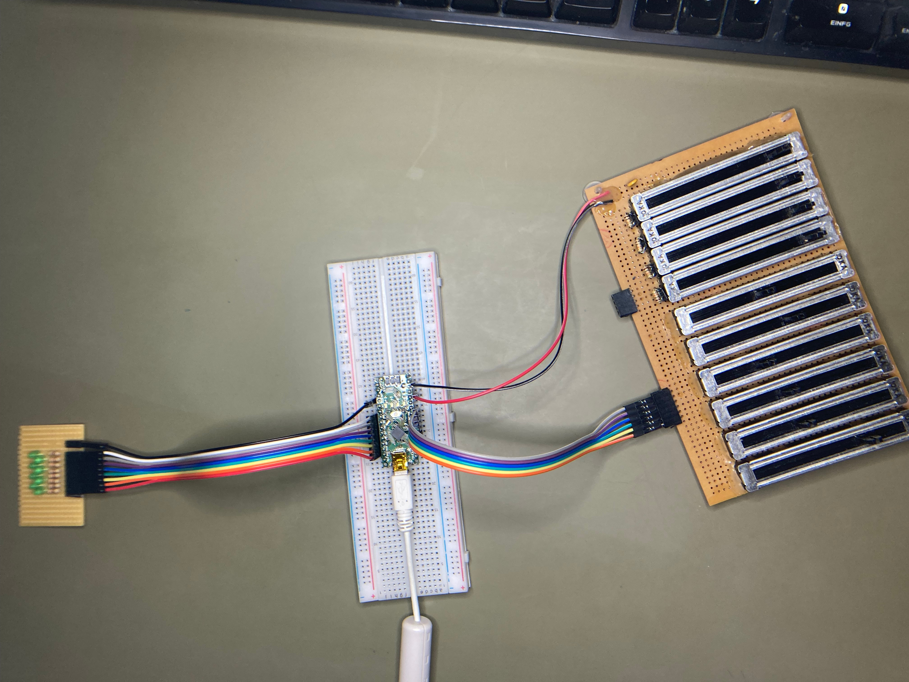
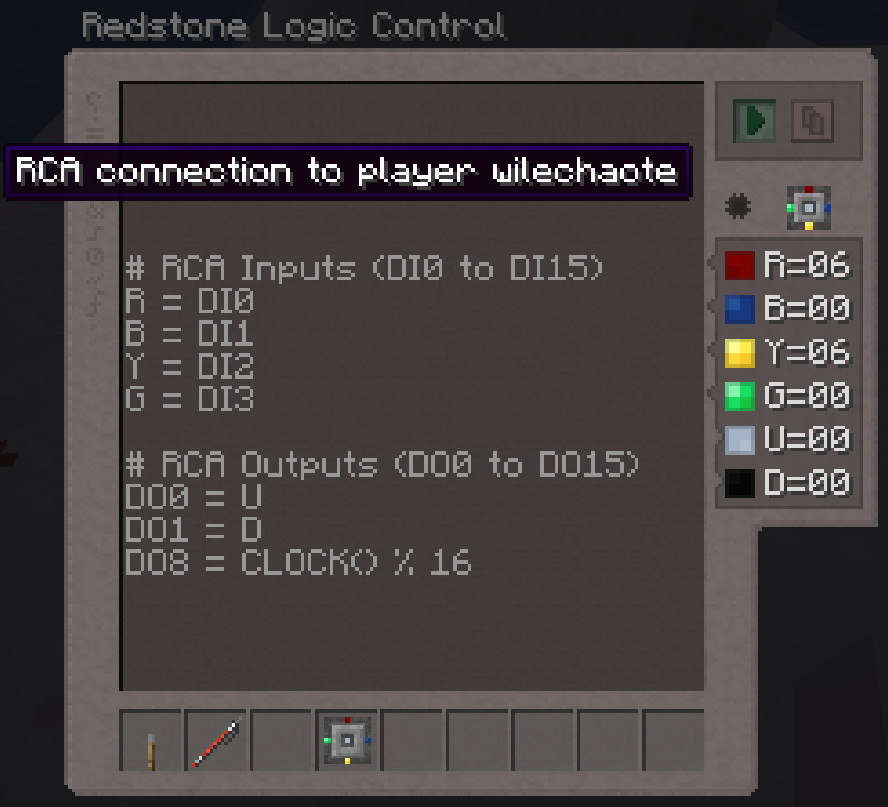
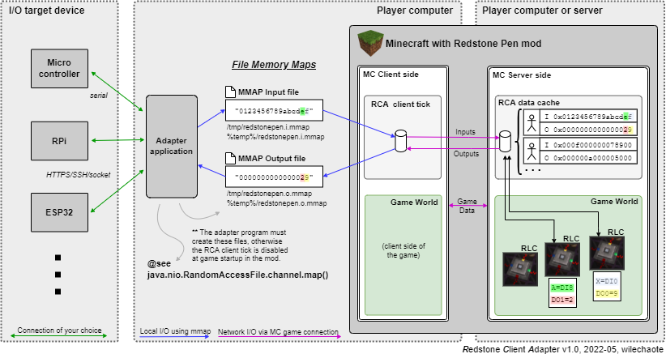
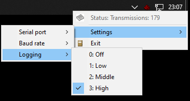

# Redstone Logic Control - Client Adapter

The RCA (Redstone Client Adapter) allows, ***if enabled on the computer***,
to bridge the Redstone Logic Control via the client machine to local or
remote electronics, such as Arduino, STM32-Nucleo, RPi, ESP32, etc. Purpose
is simply to have a boiler plate for some fun projects with said devices,
or sensors, displays, and the game we all love.

As an example and testing project, this minimal Arduino Nano test setup
with a few sliders (potentiometers) and an LED array was used [(The source code of the controller is here)](target/rca-arduino/rca-arduino.ino).
More details down the line.

----

## Game Side Usage

The handle for input and output is the Redstone Logic Control block.
If the feature is enabled, some symbols (variables) get a special
meaning:

  - `DO0` to `DO15` represent outputs from the Redstone Controllers to
    the RCA, so that LEDs, PWMs, servos, and other stuff can be controlled
    from Minecraft.

  - `DI0` to `DI15` represent inputs from the RCA to the Redstone
    Controllers. Means e.g. (real world) switches, analogue channels,
    temperatures, light sensors, etc. can be read from the client
    machine and emitted as a Redstone signal in Minecraft.

  - If a player (means most of them) has ***not explicitly enabled***
    the RCA feature, these are just ***normal variables*** like `A` or `X`.

  - When starting a RLC program (pressing the *RUN* button), the client
    side of the mod sends a "RCA-available" information to that controller
    block, which stores that it is now linked to this player. A small
    micro controller looking symbol appears in the GUI. Hovering this
    symbol will show (to everyone) to which player the RCA link is set up.
    Breaking the block removes the RCA link.

  - (Side note: The terms `DI` and `DO` are normally used in PLCs for
    "digital input"/"digital output", and I adapted this convention;
    however, pedantically speaking it's not correct - PLC DIO is only
    boolean ON/OFF, whereas our `DI0..DI15` and `DO0..DO15` channels
    can also have analog Redstone data with the known value range from
    0..15).

## Working Principle

Irregular interactions from the game to the client machine requires some
careful considerations according to security, flexibility, performance,
RAM usage, mod size, and also usability. Again, not many players need it.
We certainly do not want that mods load big (potentially untrusted) libs,
or open own (non-Minecraft controlled) network connections.
In short, it is important to move all of this out of the game into a dedicated
process that you can run on your computer (under your direct control).
There you can implement communication port handling, networking, Bluetooth,
or whatever needed, in the language you prefer. Examples for such programs
are given in this GIT feature branch.

The complete pass-through of data looks like this (questions? -> Read on below).
To depict the data format and usage, the first two inputs and outputs are
highlighted with different colors in the diagram. You can see it's quite a way
from the micro controller to the RLCs (server logic), but it's already internally
managed half the way by the mod:

### Mod Side Implementation

Among the available options provided out of the box by Java, *file memory
mapping* was considered the best fitting one. It is guaranteed local only,
approx. as fast as shared memory, and comes with minimal size overhead
because the `java.nio` encompasses this functionality already. So there are
two temporary files used as *anchor* for that mapping:

  - `<tmp-directory>/redstonepen.i.mmap`: Input, read by the mod.

  - `<tmp-directory>/redstonepen.o.mmap`: Input, written by the mod.

  - The mod does **not** create these files itself. The external adapter
    application has to do this. If the mod detects at game start that both
    files are there, then RCA will be enabled for this client machine.
    Otherwise, the hook ("event" on the client side of the mod) where the
    RCA is handled is completely disabled (unsubscribed). This shall minimize
    the performance impact for players not using the feature.

  - The format of both files are the hexadecimal digits of 16 redstone
    channels at the beginning, and optionally a line termination (`\n`/`<LF>`,
    `\r`/`<CR>`, or both). The channels are ordered big endian (ordered as
    you read a normal number), so the contents `fedcba9876543210` will
    have redstone `0` for channel 0 and 15 (`f`) for channel 15. For safety,
    the mod checks this format pedantically and ignores invalid data.

On the server side of the mod there is ***no RCA system I/O*** (marked as
client-only, so also not loaded on dedicated servers at all). The server
only accepts RCA data from *players* (like normal player data e.g. looking
direction or buffs). This data is a 64bit number (`long`, the 16 redstone
channels compacted into one number). It is stored in a thread safe map. The
Redstone Logic Controllers access this single map according to the use of
`DI<channel>` and `DO<channel>` in their programs. For each client message,
the server sends the cached outputs back to the client. Only Clients with
RCA enabled send this message - so the server overhead is almost zero if
no player uses the feature, and less data transfer than the GUI of a furnace
if a player uses RCA.

### RCA FMM Java Source Code and Examples

You can find (and copy/apply) the RCA Java code here in this branch:

  - [host/rca-java/wile/api/rca/RedstoneClientAdapter.java](host/rca-java/wile/api/rca/RedstoneClientAdapter.java):
  The RCA interface, independent of the file memory mapping technique, as
  used in the mod source code.

  - [host/rca-java/wile/api/rca/FmmRedstoneClientAdapter.java](host/rca-java/wile/api/rca/FmmRedstoneClientAdapter.java):
  File Memory Mapping specific implementation file, as used in the mod
  source code.

The gist of File Memory Mapping on different platforms is based on the
platform APIs/libraries is encapsulated in a c++ class template:

  - Linux/Unix: [`mmap()`](https://man7.org/linux/man-pages/man2/mmap.2.html)

  - Windows: [`CreateFileMapping`](https://docs.microsoft.com/en-us/windows/win32/api/winbase/nf-winbase-createfilemappinga),
    combined with [`MapViewOfFileEx`](https://docs.microsoft.com/en-us/windows/win32/api/memoryapi/nf-memoryapi-mapviewoffileex).

  - c++ class: [host/rca-cc/mmap.hh](host/rca-cc/mmap.hh)

The given JavaScript example is based on small a win32 application that is
normally used to quickly implement dynamic system tray menus. With the `mmap`
and a serial port class added, it bridges RCA to USB/TIA232/UART, and can
directly used for experiments with Arduino or similar micro controllers. (The
program is slightly "misused", but does the trick for first tests).

The complete JS part of the program is based on [`ductape-cc`](https://github.com/stfwi/duktape-cc/tree/develop) (c++ wrapper around S.Vaarala's Duktape engine).

  - [Directory with application and JS code](host/rca-djs)

  - [RCA script library part](host/rca-djs/redstone-client-adapter.djs)

  - [System-Tray-Menu application code](host/rca-djs/systray-win32/systray-menu.djs)

### Additional Details and Design Decisions

#### IPC options considered

  - Direct serial port access from Minecraft: Discarded, Java has no
    native support for that, libraries may be insecure and bloat the
    mod.

  - TCP/UDP Socket: Discarded, opening network connections (except
    using the existing official channels of Minecraft) is out of
    question.

  - File input/output I/O based: Discarded, too slow. Every sample
    tick would require open, read/write, close sys-calls. This may
    slow down the client tick rate.

  - Pipes: Discarded, named pipes (fifo) under Linux is no problem,
    named pipes are problematic under Windows (security considerations).
    Java can out of the box only connect to named pipes.

  - Unix domain sockets: Discarded, not available on win32.

  - Native shared memory: Discarded, homogenizing win32 and linux
    requires JNI/external libraries.

---
[2022-05, wile]
