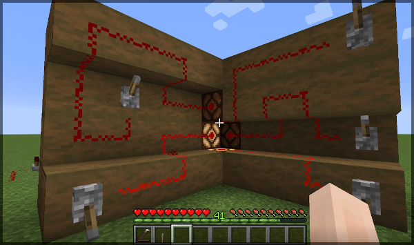
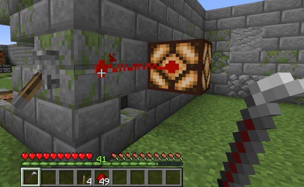
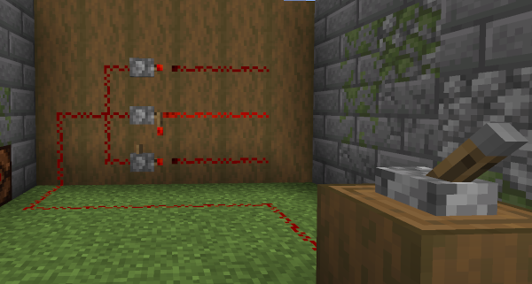
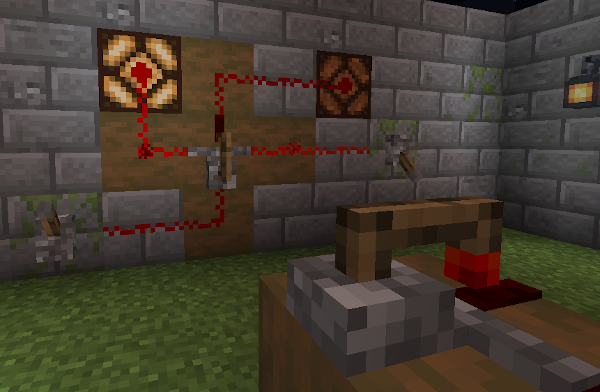
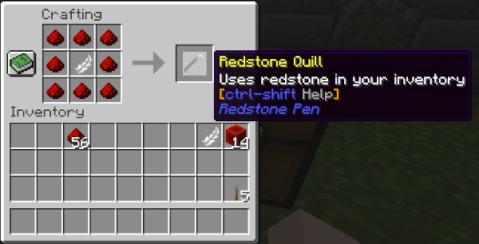
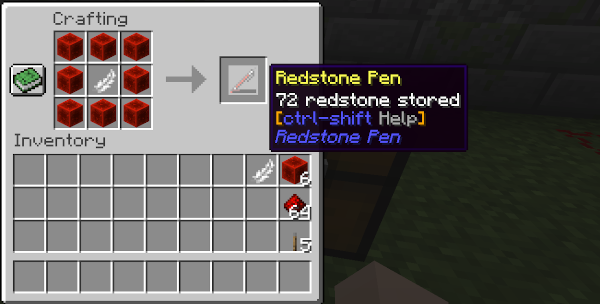
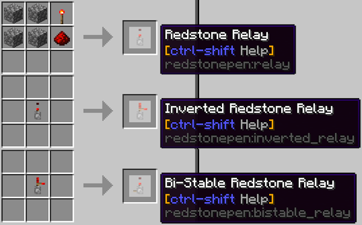

## Redstone Pen

A [Minecraft](https://minecraft.net) (Java Edition) mod adding a pen to draw
Redstone tracks more accurately. Inspired by the Redstone Paste mod.

***Note for coders/modders: Please take a look into the MC version branches to view/clone the source code.***

### Distribution file download

Main distribution channel for this mod is CurseForge:

  - Release/beta versions: https://www.curseforge.com/minecraft/mc-mods/redstone-pen/files

  - All versions: https://minecraft.curseforge.com/projects/redstone-pen/files

### Description

Adds "one pen to draw them all" - and helps with simpler Redstone handling.

#### Redstone Quill and Pen Items

Craft and use them to draw or remove thin Redstone Tracks. Multiple independent tracks through one block
space are possible. There are two versions:

- The Redstone Quill uses Redstone dust directly from your inventory.

- The Redstone Pen stores Redstone in the item, and can be refilled in the crafting grid with Redstone
  Dust or Redstone Blocks.

- Both allow to inspect the current signal of a block, track, wire, or device by sneaking while you hold
  the pen/quill and look at the block of interest.

- Both do not destroy blocks when left-clicking, except blocks with no hardness (like grass, repeaters,
  or comparators).

#### Block Signal Connectors

Especially for compact wiring it is desirable to decide weather a Track shall power the block underneath
or not. Therefore the Pen-Tracks do normally NOT connect to the block they are drawn on. To change this,
simply add an explicit connector by clicking the centre of a Track with a Pen (see the round blob in the
image). Tracks do intentionally not pass indirect power (through blocks) to other Tracks, so you can power
said blocks from independent routes without interferences:

#### Redstone Relays

Relays are like redstone powered "solenoids" that move builtin Redstone Torches back or forth, so that they
re-power ("re-lay") Redstone signals to 15. They can be placed on solid faces in all directions. Output is
only to the front, inputs are at all sides except from above. The internal mechanics ("relay types") define
what happens at the output side when the input signals change (relay, invert, flip etc). Relays also detect
indirect power from blocks they are placed on, and can therfore be used to pass Track signals through
blocks.

- **Redstone Relay:** Straight forward Input-On-Output-On relay. Different from a Repeater it has no
  switch-on delay, but instead a switch-off delay of one tick (redstone-tick=100ms).

- **Inverted Redstone Relay:**  Input-On-Output-Off relay. Switch-on delay 1 tick, no off delay.

- **Bi-Stable Redstone Relay:** Flips when detecting a off-to-on transition at the input ("rising edge";
  input off->on --> output changes).

- **Pulse Redstone Relay:** Emits a short pulse at the output side when detecting a off-to-on transition
  at the input ("rising edge").

- **Bridging Relay:** A Redstone Relay allowing to cross tracks. It forwards power back to front like a
  normal Relay, and has an additional independent wire left-to-right.

#### Recipes

